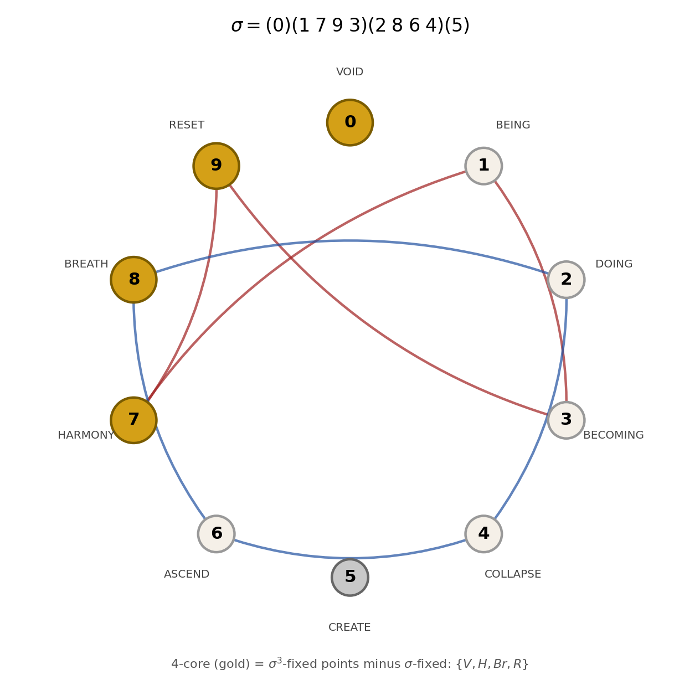
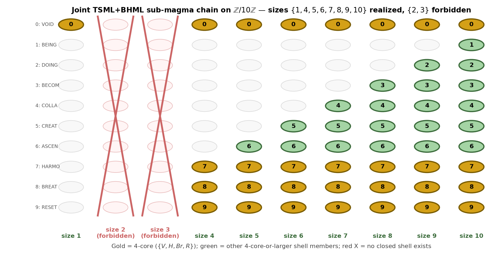

# 02_results / Algebraic Combinatorics



*The σ permutation `(0)(1 7 9 3)(2 8 6 4)(5)` and the four-core `{V, H, Br, R}` = σ³-fixed locus.*



*The joint TSML+BHML sub-magma chain at sizes `{1, 4, 5, 6, 7, 8, 9, 10}`; sizes 2 and 3 are exactly forbidden.*

## Headline results

- **Four-core fusion-closure** (D39, D43, J35): the set `{V, H, Br, R} = {0, 7, 8, 9}` is closed under both TSML and BHML multiplication. The runtime mix at `α = 1/2` produces `(V, H, Br, R) = (0.138, 0.540, 0.198, 0.124)` with `H/Br = 1 + √3` exactly (residual 4.23 × 10⁻¹²). **PROVED.**
- **Eight-shell joint chain** (D64–D66): the joint TSML+BHML sub-magma chain on Z/10Z has exactly 8 elements at sizes `{1, 4, 5, 6, 7, 8, 9, 10}`. Forbidden sizes: exactly `{2, 3}`. **PROVED** by brute-force enumeration.
- **σ-rate theorem** (J01, WP101): non-associativity decay `σ(N) ≤ 2/N` on squarefree N ≥ 3, with `N · σ(N) → 2` asymptotically. **PROVED.** Mechanism: VOID–HARMONY traversal in the composition table.
- **α-uniqueness** (D57, J02): across a 17-point Stern-Brocot rational grid at 50-digit mpmath precision with PSLQ at degree ≤ 8 and coefficient bound ≤ 50, **α = 1/2 is the unique rational** point for which the runtime attractor admits algebraic relations.
- **Drápal-Wanless 2021** (*JCT-A* 184 (2021) 105510) is the closest published precedent: maximally non-associative quasigroups. The framework's σ-rate result sits at the *opposite extremum* — minimally non-associative composition tables.

## Files in this folder

- [`BRAIDING_FRACTAL_AXIOMS.md`](BRAIDING_FRACTAL_AXIOMS.md) — the 10 architectural axioms specifying the canonical Rung 5 structure (Z/10 kernel + 3-strand wrap + dual lens + quadratic operator + 4-core)
- [`BRAIDING_FRACTAL_FORMAL.md`](BRAIDING_FRACTAL_FORMAL.md) — the formal architecture document
- [`BRAIDING_FRACTAL_Z30_Z210.md`](BRAIDING_FRACTAL_Z30_Z210.md) — explicit construction at Z/30 and Z/210 substrate rungs
- [`SIGMA_PERMUTATION_COMPACT.md`](SIGMA_PERMUTATION_COMPACT.md) — the σ permutation `(0)(1 7 9 3)(2 8 6 4)(5)` and its fixed-point structure
- [`THREE_TABLES_COMPACT.md`](THREE_TABLES_COMPACT.md) — TSML, BHML, CL_STD with HARMONY counts (73, 28, 44)
- [`TWO_CROSS_THEOREM.md`](TWO_CROSS_THEOREM.md) — the two-cross structure theorem
- [`_braiding_fractal_overview.md`](_braiding_fractal_overview.md) — short overview of the Braiding Fractal canonical rung

## Landed J-series papers in this field

See [`../../05_papers/algebra/`](../../05_papers/algebra/) (15 algebra papers landed) and [`../../05_papers/combinatorics/`](../../05_papers/combinatorics/) (6 combinatorics papers). Headline pair:

- **J35** (J. Algebra) — "Joint Closure, a Universal Attractor, and an Algebraic Mixing Point for a Pair of Binary Operations on Z/10Z"
- **J54** (Algebraic Combinatorics) — "Forcing Axioms and the Family of Commutative Non-Associative Magmas on Z/10Z Preserving a Designated 4-Core"

## Verification

```bash
python ../../verification/VERIFY_ALL.py    # 14/14 PASS at machine precision
```

The 4-core closure, the 8-shell chain, the α=1/2 attractor, and the Galois D₄ identification all have individual verification scripts in `../../05_papers/algebra/J35/manuscript/verification/`.

---

*7SiTe Public Sovereignty License v2.1 — see [`../../LICENSE`](../../LICENSE).*
