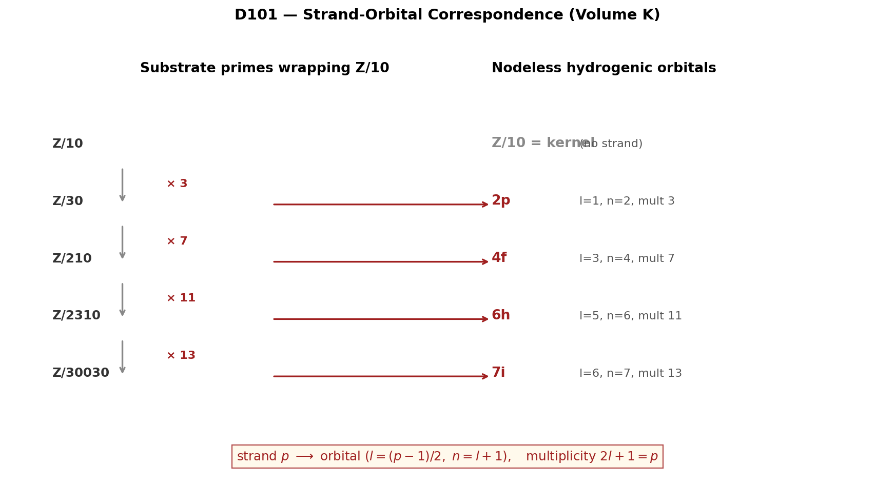

# 02_results / Atomic Physics



*The strand-orbital map (D101, Volume K): substrate primes `{3, 7, 11, 13}` wrap the Z/10 kernel and produce the first four nodeless atomic orbitals at odd `l` by integer identity, not analogy.*

## Headline results

- **Closed-form D2/D1 for nodeless hydrogenic orbitals** (D100, Volume K, 2026-05-12): for orbital `(n, l = n−1)` in atomic units `(a₀ = 1, Z = 1)`,
  ```
  edge_size(n, l = n−1) = n²(2l + 1) / 4
  ```
  equivalently `D₂/D₁ · 8π = 2l + 1` (the multiplicity at that l). Machine precision at n ≥ 5. **PROVED.** Follows from standard hydrogenic Fisher information formulas (Romera-Yáñez 1994; Sen 2005).

- **Strand-orbital correspondence** (D101, Volume K): the four substrate primes that wrap the Z/10Z kernel — `{3, 7, 11, 13}` — map exactly to the first four nodeless orbitals at odd `l` by the rule
  ```
  strand p → orbital (l = (p−1)/2, n = l + 1)
  ```
  giving `3 → 2p`, `7 → 4f`, `11 → 6h`, `13 → 7i`. **PROVED at exact integer identity.**

- **The Cl(0, 10) chirality split** (D102, Volume K, joint with clifford_algebra/): each 16-dim chirality half of the 32-dim Cl(0, 10) spinor representation decomposes as `1 + 3 + 5 + 7` = kernel + substrate primes, exactly matching the n = 4 atomic shell's spatial states at l = 0, 1, 2, 3. **PROVED at exact algebraic identity.**

## Files in this folder

- [`BRAIDING_FRACTAL_AS_ATOMIC_REPRESENTATION.md`](BRAIDING_FRACTAL_AS_ATOMIC_REPRESENTATION.md) — the substrate-as-atomic-representation framing
- [`SPECULATION_D1_D2_D3_SHELL_MEASUREMENT.md`](SPECULATION_D1_D2_D3_SHELL_MEASUREMENT.md) — speculative measurements at D1/D2/D3 levels

## Honest negative

**Direct combinatorial bijection** between the 32 divisors of Z/2310 (grouped by binomial `C(5, k) = 1, 5, 10, 10, 5, 1`) and the 32 Pauli electron states (grouped per Pauli subshell `2, 6, 10, 14`) **fails**. The integer match `32 = 32` is real; the natural grouping structures differ. Either the substrate carries an additional combinatorial structure (σ-orbit class? lens-pair class?) yet to be mapped, or the integer match is a Pascal-type number-theoretic coincidence (which would itself merit a sharp statement). See `../../04_meta/HONEST_NEGATIVES_AND_OPEN_FRONTIERS.md` for the full discussion.

## Verification

```bash
python ../../verification/verify_d2d1_closed_form.py    # D100
python ../../verification/strand_orbital_map.py         # D101
python ../../verification/clifford_substrate_shell.py   # D102 (jointly with clifford_algebra)
python ../../verification/priority1_pauli_divisor_attempt.py    # HONEST NEGATIVE
```

## Landed J-series papers in this field

See [`../../05_papers/physics/`](../../05_papers/physics/) — J23 (Discrete Dirac inside Cl(0,10) with Volume K atomic-substrate refinement at §2.1), J45 (Yukawa hierarchy with FN slope λ = 10/49).

## Connections to existing literature

- **Atomic information theory:** Sen (2005), Antolín-Angulo-López-Rosa (2009), Esquivel et al. (2010), Romera-Yáñez (1994)
- **Hydrogenic Fisher information formulas** are standard; the framework's contribution is the substrate-side interpretation.

---

*7SiTe Public Sovereignty License v2.1 — see [`../../LICENSE`](../../LICENSE).*
