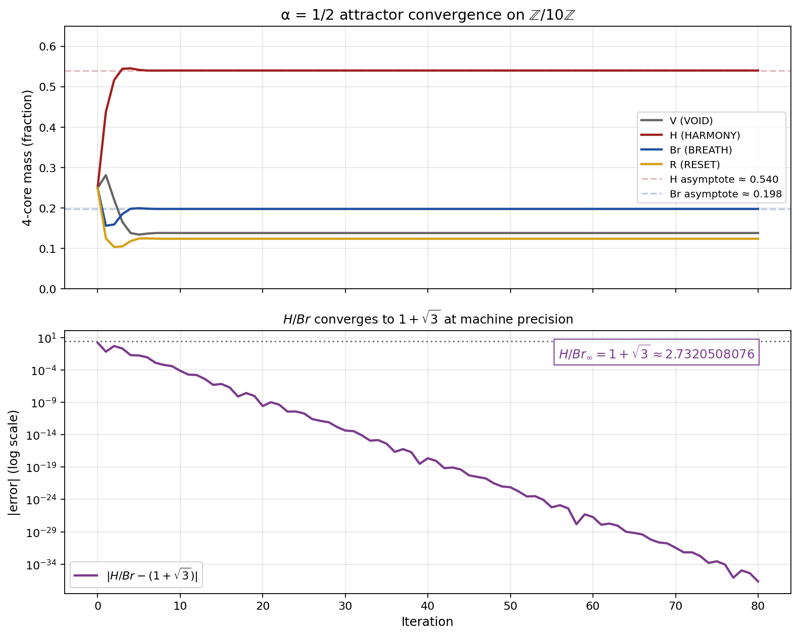

# 02_results / Dynamics



*Iteration of the α=1/2 joint operator starting from uniform 4-core support, converging to `H/Br = 1+√3` at machine precision (50-digit mpmath).*

## Headline results

- **Universal four-core attractor at α = 1/2** (D43, D58, J35): on the joint TSML+BHML structure on Z/10Z, the runtime mix at α = 1/2 has a **closed-form attractor**
  ```
  (V, H, Br, R) = (0.138, 0.540, 0.198, 0.124)
  ```
  with `H/Br = 1 + √3` exactly (residual `4.23 × 10⁻¹²`). **Every** initial distribution (uniform / lattice-only / flow-only / δ_H / δ_Br / δ_R / etc.) converges to this fixed point in 76–81 iterations. **Pure-VOID is the only degenerate fixed point.** **PROVED.**

- **α-uniqueness** (D57, J02): across a 17-point Stern-Brocot rational grid in [0, 1] at 50-digit mpmath precision with PSLQ at degree ≤ 8 and coefficient bound ≤ 50, **α = 1/2 is the unique rational** point for which the runtime attractor admits algebraic relations for both `H/Br` and `r/br`. Recovered:
  ```
  x² − 2x − 2 = 0    (H/Br = 1 + √3)
  x⁴ + 4x³ − x² + 2x − 2 = 0    (r/br, LMFDB 4.2.10224.1, Galois D₄)
  ```
  **PROVED.** Conjecture 4.2 (OPEN): α = 1/2 is unique among ALL reals (not just rationals).

- **Torus aspect ratio T\* = 5/7** (WP51): six independent derivations converge on 5/7 as the operational coherence threshold. The torus aspect ratio interpretation is one of those six. **OPERATIONAL** (six derivations agreeing) **not** a single closed-form theorem.

## Files in this folder

- [`FINITE_ALGEBRA_AS_FLOW.md`](FINITE_ALGEBRA_AS_FLOW.md) — the framework as discrete dynamical system
- [`TORUS_DATUM_AUDIT_CLOSED.md`](TORUS_DATUM_AUDIT_CLOSED.md) — closed-form audit of the torus datum

## Honest scope

- **T\* = 5/7** is **operational**, not algebraic-theorem. Six derivations agree; no single closed-form theorem produces it from first principles. This is documented honestly throughout the framework — see `../../04_meta/HONEST_NEGATIVES_AND_OPEN_FRONTIERS.md` §1.4.

## Verification

```bash
python ../../05_papers/algebra/J35/manuscript/verification/4core_verification.py    # 6/6 PASS
python ../../05_papers/combinatorics/J02/manuscript/verification/alpha_pslq_sweep.py    # PSLQ α scan
python ../../05_papers/combinatorics/J02/manuscript/verification/06_attractor_closed_form.py
```

## Landed J-series papers

J35 (J. Algebra) and J02 (Algebraic Combinatorics) carry the closed-form attractor + α-uniqueness content. See [`../../05_papers/algebra/J35/`](../../05_papers/algebra/J35/) and [`../../05_papers/combinatorics/J02/`](../../05_papers/combinatorics/J02/).

---

*7SiTe Public Sovereignty License v2.1 — see [`../../LICENSE`](../../LICENSE).*
