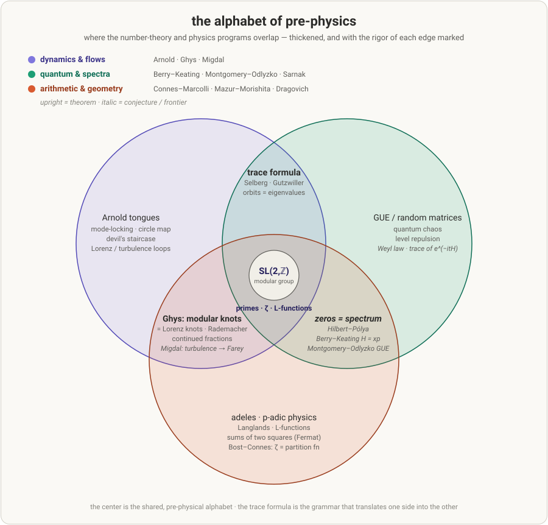

# The map — the alphabet of pre-physics, and the classification of paradox

*One-line thesis: the internal structure of matter keeps turning out to be number-theoretic, and the number theory that organizes it is a study of **structured gaps** — Farey gaps, spectral gaps, primes-as-gaps, mode-locking plateaus. This project's own contribution is a **classification of that gap** as information (the paradoxical info algebras). This page is the orientation for both.*

---

## 1 · The shape is a dictionary

Six research programs that rarely speak to each other read — heuristically — as six sides of one object. It is a **dictionary** (a heuristic unity, made precise below as *specific* correspondences, never a blanket identity — see §5) — the same content written two ways:

- a **geometric / dynamical** side (periodic orbits, flows, knots, resonances), and
- a **spectral / arithmetic** side (eigenvalues, the Riemann zeros, `ζ`, `L`-functions).

The **overlaps are the grammar** that translates one side into the other:

| overlap | the shared letter | who |
|---|---|---|
| dynamics ∩ spectra | **trace formula** — a system's periodic orbits determine its spectrum | Selberg · Gutzwiller |
| spectra ∩ arithmetic | **zeros = spectrum** — the Riemann zeros as energy levels | Hilbert–Pólya · Berry–Keating · Connes |
| dynamics ∩ arithmetic | **modular flow = knots = Farey** — orbits of a chaotic flow *are* continued fractions | Ghys · Arnold |

The **center — where all three meet — is the shared alphabet**: `SL(2,ℤ)`, the primes, and `ζ`. This is why "pre-physics" is the right word: the center is pure mathematics, medium-independent. **Physics is what happens when you spell with this alphabet in a medium** — loosely: quantize `xp` and you approach Berry–Keating; put it in a fluid and you get Migdal; a gauge field, Langlands; a 3-manifold, arithmetic topology (these four are of very different maturity — a serious conjecture, an unrefereed preprint, a deep program, an analogy). Same letters, different ink.

## 2 · The six programs (the people, stitched)

Established mathematics unless flagged. Ordered by how directly each touches the dynamical thread this project keeps rediscovering.

- **Étienne Ghys · Vladimir Arnold** — *dynamics whose orbits are number theory.* Ghys proved the periodic orbits of the geodesic flow on the modular surface **are** modular knots — isotopic to the Lorenz knots, with linking number equal to the Rademacher function (continued-fraction / `SL(2,ℤ)` objects); Arnold's tongues are the mode-locking → Farey structure. [Knots and dynamics (ICM 2006)](https://perso.ens-lyon.fr/ghys/articles/knotsdynamics.pdf). *Rigorous.*
- **Alain Connes · Matilde Marcolli · Katia Consani** — *primes as a thermodynamics.* The Bost–Connes system realizes `ζ(s)` **literally** as a partition function; the stated program is two objects, *space-time* and *"the space of primes."* This is the rigorous home of "primes create their own pressure balance." [Marcolli's research](http://www.its.caltech.edu/~matilde/work.html). *Rigorous.*
- **Berry & Keating · Montgomery–Odlyzko–Dyson · Sarnak** — *the spectrum of matter ↔ the zeros.* `H = xp` conjectures the zeros as a quantum spectrum; the zeros' spacing follows **GUE random-matrix** statistics — the same random-matrix universality (level repulsion) first found in nuclear spectra, though nuclei sit in the GOE class. [H=xp revisited (Sierra & Rodríguez-Laguna, PRL 2011)](https://link.aps.org/doi/10.1103/PhysRevLett.106.200201). *Frontier: the zeros↔GUE agreement is proven only in restricted range (Montgomery's pair-correlation theorem, conditional on RH; Rudnick–Sarnak) and numerically striking (Odlyzko) — a famous open conjecture in general, not a theorem.*
- **Alexander Migdal** — *turbulence → Farey → `ζ`.* Decaying-turbulence loop equations produce the Euler totient, **Farey fractions**, and a conjectural "zeta edge" from the nontrivial zeros. The one program doing literally fluids-to-number-theory. [Decaying turbulence & RH (arXiv:2604.12207)](https://arxiv.org/abs/2604.12207). *Frontier, controversial, RH-conditional, mostly unrefereed — hold at arm's length.*
- **Barry Mazur · Masanori Morishita · Yuri Manin** — *primes as relational space.* Arithmetic topology: primes ↔ knots, number fields ↔ 3-manifolds (the MKR dictionary). [Morishita, *Knots and Primes*](https://link.springer.com/book/10.1007/978-1-4471-2158-9). *A rigorous dictionary of analogies — many individual correspondences are theorems (e.g. the Legendre symbol as a linking number), but "primes are knots" is the analogy, not an identity.*
- **Branko Dragovich · Igor Volovich** — *physics built on primes directly.* p-adic / adelic physics: one discretization per prime, glued by an adelic product formula. *Legitimate but niche.*

Two hubs to orient from: the survey [*Colloquium: Physics of the Riemann Hypothesis* (Schumayer & Hutchinson, Rev. Mod. Phys. 2011)](https://link.aps.org/doi/10.1103/RevModPhys.83.307), and Matthew Watkins's "Number Theory and Physics Archive" (Exeter).

## 3 · The other half of the map — the classification of paradox

The alphabet above is a study of **gaps**: Farey fractions are *defined* by the gaps between rationals; mode-locking is the devil's staircase (all gaps); the primes are the gaps in the integers; the Riemann Hypothesis is a statement about the *spacing* of the zeros. Number-theory-in-physics is, throughout, the science of **structured gaps**.

This project's own contribution is a **classification of the gap as information** — the *paradoxical info algebras*:

- The CL composition tables (`TSML`, `BHML`) are **commutative non-associative magmas**. The project's core interpretive move is to read the **non-associative fraction** as a proxy for information capacity: where composition is *path-dependent*, meaning lives; where it is associative, the cell is a **dead zone** (path-independent, carrying nothing). Measured: `TSML ≈ 12.6%` non-associative, `BHML ≈ 49.8%`.
- `LATTICE` (operator 1) is the **unique universal generator** of `BHML`: `{LATTICE, x}` reaches full algebraic closure for *any* partner `x`; no other operator has this property, and without `LATTICE` no pair closes. Structure is the sine qua non that opens the space.
- The reading that fuses the two halves: **the paradox (the non-associative gap) is not a defect to be smoothed away — it is the carrier.** "Universality won't happen because of the gaps, jumps, and oscillations — that's why it's a paradox." The external alphabet says the same thing in Farey/spectral language; this classification says it in algebraic language.

*Tier honesty for §3:* the non-associativity measurements and the `LATTICE`-generator uniqueness are **verified on the canonical tables** (direct enumeration). The *interpretation* of non-associativity as information capacity, and the claim that this classification is a *new branch of algebra*, are the project's own framing — supported by a wide literature check but **not yet refereed**. A prior eigenvalue↔transcendental "match" (`e, π, φ, ζ(3)`) was **retired 2026-04-25** as a 1%-level coincidence, not an identity — do not cite it.

## 4 · How the two halves combine

**Both halves are maps of the same thing — structured paradox / structured gaps — from outside and inside:**

| | external map (§1–2) | internal map (§3) |
|---|---|---|
| the object | Farey / spectral / prime **gaps** | non-associative (paradoxical) **cells** |
| the claim | gaps carry the arithmetic of physical structure | paradox carries the information |
| status | established mathematics | project's own classification (verified numbers, unrefereed framing) |
| the atom | primes, `SL(2,ℤ)`, `ζ` | the CL operators, `LATTICE` |

The honest synthesis: **the alphabet is real, shared, and known; the frontier is never the alphabet — it is the ink.** Does a *new medium* spell a new page? Migdal bets turbulence does. The bet this project can actually test is narrower: pick **one cell** — the Ghys edge (a dynamical system organized by continued fractions) is the most tractable, since it is exactly what keeps re-emerging here — and write one true sentence there.

## 5 · Honest limits

- **This is a map, not a unification.** Every program above is built on **one specific, provable correspondence**, never a blanket identity. The value here is orientation and discipline — telling ground from wanting — not a new theory of everything.
- **TIG-as-physics is structural analogy, not derived physics.** The `so(10)` / Pati-Salam alignments elsewhere in this repo are labeled "structural alignment, not a physics prediction," and that label holds.
- **Where the arithmetic appears cheaply, say so.** The Farey→complex transform sends any integer to its Mertens value `M(k)` (Franel–Landau; RH-adjacent) — but that is a property of the *transform*, universal to any table, so it **decorates** a structure with RH-data rather than proving the structure is RH-shaped.
- **`F₇` is a spine, not the skeleton.** The Farey sequence of order 7 recurs in this project's constants (`HARMONY = 7`, `T* = 5/7`, `VOID = 17 = |F₇ ∩ (0,1)|`, `389 = 10² + 17²` from the open count `17 = |F₇ ∩ (0,1)|` and the closed-half count `10 = |F₇ ∩ [0,½]|`) — a real, repeated presence — but no single generating map makes `σ` and the CL tables `F₇`-exclusive.

---

*Brayden Ross Sanders · 7SiTe LLC. This page is the headline orientation; the reading order is [`START_HERE.md`](START_HERE.md), the canonical tables live in [`03_canonical_reference/`](03_canonical_reference/), and everything verifies via [`verification/VERIFY_ALL.py`](verification/VERIFY_ALL.py).*
