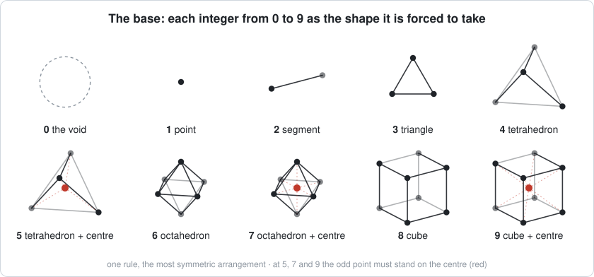

# The base — the integers 0–9 as shapes

The ground floor. Read an integer as a configuration of points and ask what shape it is forced to
take — the premise of *[The Shape of Understanding](https://github.com/TiredofSleep/shape-of-understanding)*.
Every shape here is the bottom of one or more **towers** of higher mathematics; the map of where
each one points is [`../towers/THE_TOWERS.md`](../towers/THE_TOWERS.md). And from 4 on, every
integer is a **coin**, with a flat face (in the plane) and a solid face (in space). At 5, 7 and 9 the
coin is whether the centre is inhabited, and both faces are kept: see
[`../coin/THE_COIN.md`](../coin/THE_COIN.md).



> **Run the checks** (Python 3.10+, numpy):
>
> ```
> python verify_integers.py       # which rule realizes which integer, 0–9
> python verify_one_rule.py       # one rule for all ten: the most symmetric arrangement
> python verify_forced_chain.py   # the simplex ladder, the tetrahedral 1/3, the cube = Cl(3)
> ```

| file | what it is |
|---|---|
| [`THE_INTEGERS.md`](THE_INTEGERS.md) | **Start here.** 0–9 one at a time, each with the rule that picks its shape — and the tower each one points to. |
| [`SEVEN_AND_NINE.md`](SEVEN_AND_NINE.md) | **One rule for all ten.** The book's own rule — the most symmetric arrangement — kept in three-dimensional space realizes every integer 0–9 uniquely: 7 = the octahedron with its centre, 9 = the cube with its centre (and 5 = the tetrahedron with its centre). This is checked over every symmetry group of 3-space. The odd ones must stand on their centres, because every solid symmetry group has only even orbits besides the centre. 5, 7 and 9 are classified, not chosen: the flat face (the polygon) and the solid face (the centred solid) are both kept. |
| [`integers_as_geometric_entities.md`](integers_as_geometric_entities.md) | **P1.** The ladder 1–4 and the tetrahedral 1/3 = 1/(N−1) at N = 4, with where that geometry is measured (the carbon bond angle, the NMR magic angle) and a recorded boundary of what does not follow. |

Tags: **[FORCED]** follows from the named rule and has a line in a verify script · **[RULE]** names
the rule that picks a shape · **[NAMED]** a cited standard theorem · **[READING]** an interpretation
· **[COIN]** a classified pair: both faces kept, neither chosen, the edge named · **[FENCE]** two things that share a number but are not one object.
